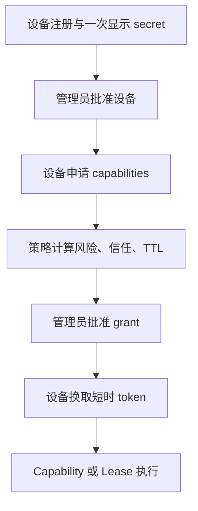

# Stage 5 安全模型

## 信任链

客户端不能自报风险、信任或批准方式。策略只由当前 App 清单和数据库状态推导。

## 秘密

- 用户密码只保存 Argon2id hash；session secret 与业务凭据使用 `keychain:` / `env:` 引用。
- device secret 和 access token 只显示一次；SQLite 只保存带 Gateway pepper 的 HMAC-SHA256。
- Gateway 不读取 Local Mailer 的 Microsoft Graph token 或配置，只用固定 argv 调用其脚本。
- 审计、通知和 system state 在落盘前递归删除 password/secret/token/authorization/cookie/credential/private-key 字段。

## 浏览器与控制面

- Secure/HttpOnly/SameSite Cookie、会话期限、CSRF、Host allowlist、Origin 检查与登录限速。
- App 展示、详情、打开和代理是相互独立的角色权限。
- Registry 保存使用严格模型、跨 App 冲突检查、固定文件名、原子替换和 revision 冲突保护。
- 停用/更新应用前必须释放 Lease；危险操作在 UI 中要求确认。

## HTTP 与 WebSocket 代理

- 只代理清单声明的 capability route、mount 或 WebSocket prefix。
- 拒绝点路径、编码分隔符、反斜线、重复斜线与非 canonical raw path。
- Gateway Cookie、Authorization、伪造 `X-Gateway-*`、hop-by-hop header 和子 App 覆盖 Gateway session 的 Cookie 都被移除。
- 请求体先进入有上限的 `SpooledTemporaryFile`，小请求留内存，大请求落临时盘；超过限制返回 413。
- WebSocket 要求已登录会话、受信 Origin、允许代理的角色和显式路径；消息大小与空闲时间受清单限制。
- 本地 HTTP client 不继承系统代理环境，只连接运行记录中的 loopback origin。

## Lease 与生命周期

- Lease 按 `resource_key` 引用计数：首个 holder 执行 acquire，最后一个 holder 执行 release。
- missed heartbeat、过期/撤销 device 或 grant、激活中断都会进入 releasing；失败持久化并指数退避。
- probe 检测资源漂移并纠正；通知只在状态转换或冷却边界发送。
- 恢复、停止和强杀前验证 PID 代际身份；缺失身份的旧记录 fail closed，不向可能复用的 PID 发信号。
- 自动重启使用滚动窗口预算、最大退避、稳定期重置与维护窗口。

## 数据库升级

v0 首先备份并迁移至 v1；v1 在 `pre-stage2-v2` 备份后迁移至 v2。v2 增加 Registry、Notification、System State 和通用 Lease 协调字段。所有业务写入使用显式事务、外键与索引。

## 未开放能力

TOTP、桌面批准、payload hash、critical action、密钥轮换、恢复码和 break-glass 已在 Stage 3–5 实现。配置模型会拒绝缺少逐次批准、payload preview 或一次性 Token 的 critical action 组合。
